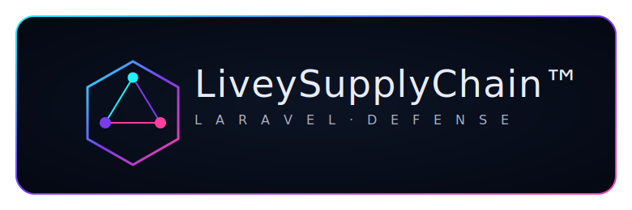

# LiveySupplyChain

<p align="center">
  
</p>

Composer supply-chain security toolkit with a Python CLI, LiveyScore v3, policy-driven controls, JSON reporting, and an HTML dashboard.

## Features
- LiveyScore v3 weighted scoring for Composer dependencies (vendor trust, version hygiene, maintenance, popularity, script risk, binaries, dependency posture, policy alignment + anomalies)
- Safe YAML policy schema with allow/deny lists and thresholds
- Offline-first scanner; optional Packagist metadata with cache
- CI-friendly JSON reports and exit codes
- Rich-powered CLI with explain mode
- Dashboard for filtering/severity visualization

## Installation
```bash
pipx install livey-supplychain
# or
pip install livey-supplychain
```

## Quickstart
```bash
livey-supplychain init-policy
livey-supplychain scan --offline --output reports/report.json
livey-supplychain explain symfony/console
livey-supplychain report --online --output reports/report.json
```
- Fail builds below threshold: `livey-supplychain scan --fail-under 75`
- Clear cache: `livey-supplychain cache clear`

## CLI Commands
- `scan` – scan composer.lock and compute scores
- `explain` – detailed breakdown for packages
- `init-policy` – write default policy
- `report` – generate report JSON
- `score` – quick score table
- `cache clear` – purge Packagist cache
- `version` – show version

## Policy
Default policy lives at `tools/supply_chain_policy.yaml`. Customize weights, allow/deny lists, vendor classes, penalties, bonuses, and severity thresholds.

## Reports & Dashboard
- JSON report written to `reports/report.json`
- Open `assets/dashboard.html` locally and load the report file (supports sorting, filtering, severity colors, dark mode, reasons/anomalies).

## Development
```bash
python -m venv .venv
source .venv/bin/activate
pip install -e .
pip install pytest
pytest
```

## Security
See `docs/SECURITY.md` for disclosure process. Offline mode is default; Packagist access is opt-in via `--online`.

## License
MIT
